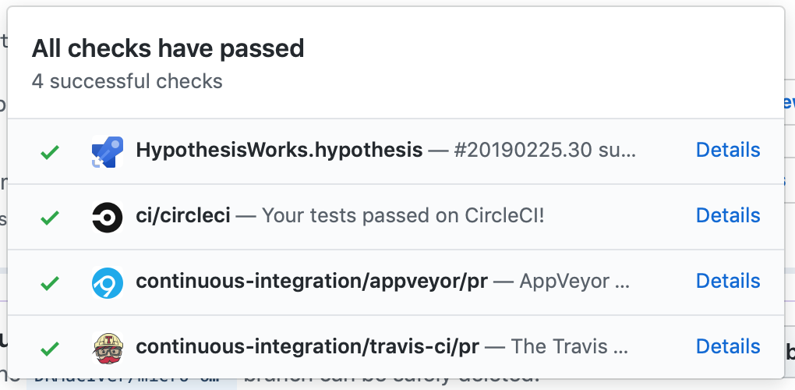

**Archived 26 May 2022.** This repo is unmaintained and out-of-date; you should probably look at a different Action if you want to auto-merge your pull requests.

> I only ever used this action on a single repository, [alexwlchan/alexwlchan.net], where I would use the following workflow:
>
> * Write a new blog post
> * Open a PR for the blog post
> * Use Azure Pipelines to build and test the new post (e.g. look for broken links, missing alt text)
> * If the build succeeded, merge the post and deploy it to my site
>
> It used the [`check_run` event][check_run] to notice when the Azure Pipelines build was done, and auto-merge the pull request.
>
> I always thought I'd use it in more places, but that never happened.
>
> In May 2022 I stopped using Azure Pipelines, and I switched that repo's CI exclusively to GitHub Actions.
> I couldn't find an easy way to use this Action with the rest of my new Actions-based pipeline, so I replaced it with [a shell script][script] that lives in that repo.
> 
> There are other Actions for doing auto-merging of pull requests which are better maintained and more full-featured.
> I've left the README and code in place in case it's useful for somebody building a new Action, but I don't recommend anybody use this for new projects.

[alexwlchan/alexwlchan.net]: https://github.com/alexwlchan/alexwlchan.net
[check_run]: https://docs.github.com/en/developers/webhooks-and-events/webhooks/webhook-events-and-payloads#check_run
[script]: https://github.com/alexwlchan/alexwlchan.net/blob/f01cca80db3bbab80efba87e5a6639bc1f0f24af/.github/workflows/build_site.yml#L25-L29

---

#code changes to the master
# Auto merge my pull requests

A GitHub Action to automatically merge pull requests on my repositories if:

*   I opened the PR
*   The test suite is passing
*   I haven't marked the PR as a WIP

After the PR is merged, it deletes the branch to keep things neat and tidy.


## Motivation

I have a bunch of repos where I'm the only contributor, and I want to merge pull requests as soon as tests pass.
(The repo with [my blog](https://github.com/alexwlchan/alexwlchan.net), for example.)

This Action saves me the work of actually pushing the button, and means they get merged a little faster.

The Action is defined in a separate repo that doesn't have auto-merging pull requests so that somebody can't merge a PR with malicious code by editing the underlying Action.


## Usage

Fork this repo, add your own rules in `merge_and_cleanup_branch.py`.

Reference the Action in your `.workflow` file:

```hcl
workflow "merge_and_cleanup" {
  on = "pull_request"
  resolves = ["when tests pass, merge and cleanup"]
}

action "when tests pass, merge and cleanup" {
  uses = "yourname/auto_merge_my_pull_requests@development"
  secrets = ["GITHUB_TOKEN"]
}
```
# Code changes to the master branch


## Limitations

*   This will only merge pull requests which I opened.
    If you use this Action unmodified, you'll grant me magic PR-merging powers.

*   I'm only using this on repos that have a single test task.
    So it can handle this:

    

    but it gets confused by this:

    

    It will try to merge the pull request as soon as one of those checks completes.
    I only have a single task on each of my repos, so that's fine for me -- something like the `check_suite` trigger is probably more appropriate for larger builds.


## License

MIT.
